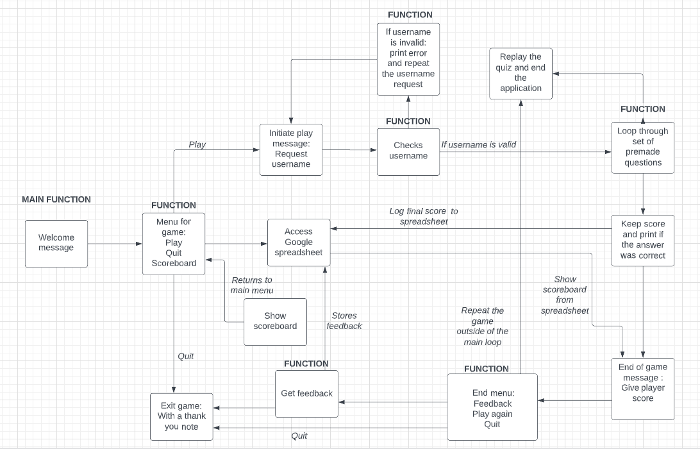
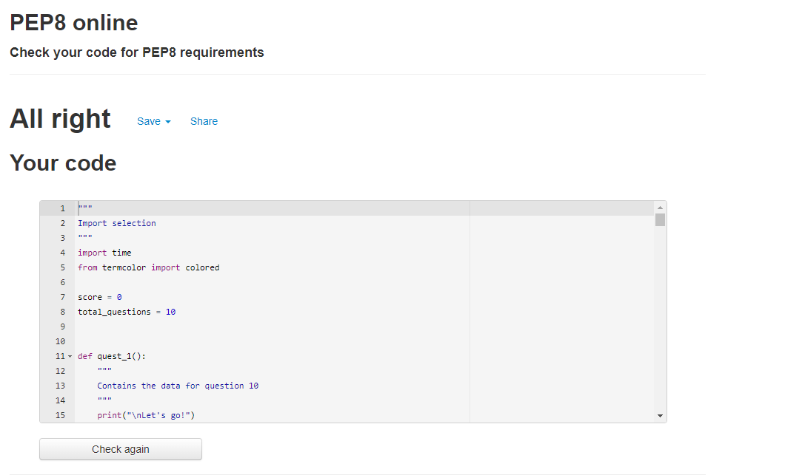
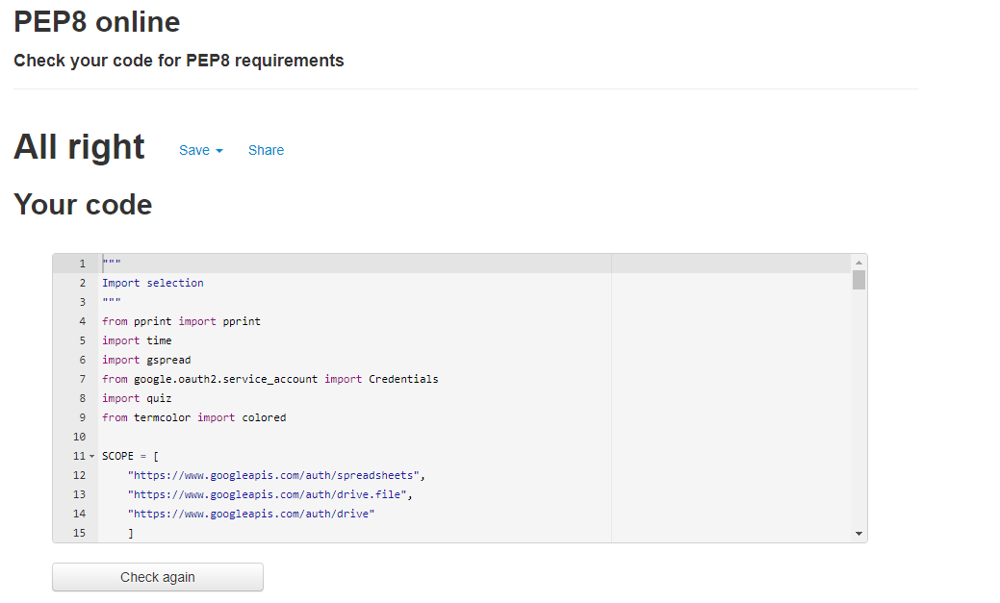

## Reminders

* Your code must be placed in the `run.py` file
* Your dependencies must be placed in the `requirements.txt` file
* Do not edit any of the other files or your code may not deploy properly

## Creating the Heroku app

When you create the app, you will need to add two buildpacks from the _Settings_ tab. The ordering is as follows:

1. `heroku/python`
2. `heroku/nodejs`

You must then create a _Config Var_ called `PORT`. Set this to `8000`

If you have credentials, such as in the Love Sandwiches project, you must create another _Config Var_ called `CREDS` and paste the JSON into the value field.

Connect your GitHub repository and deploy as normal.

Live site is here - https://japan-quiz.herokuapp.com/

# Japan Quiz

I thought it would be interesting to do a quiz on Japan. I spent over 4 years living and working in Japan, between Tokyo and Hiroshima. It is a country that will always be special to me. Making a quiz about a place I love, while learning how to code (something I am becoming passionate about) has been a pleasure. 

# Table of Contents

# The Goal for this project

# UX

## User Goals 
+ To be amused by testing my facts and learn a variety of useful facts about Japan.

## Audience:
+ - This quiz is intended for anyone who would like to test or broaden their knowledge of Japan.

## User stories

+ As a user, I want to see my score and be able to compare it with others
+ As a user, I want to do a quiz that has an intuitive flow.
+ As a user, I want to learn something about Japan.
+ As a user, I want to have my knowledge tested.

## Site owner's Goals
+ To create a fun and somewhat challenging quiz.
+ To create a quiz with an intuative design.
+ To wrote code that follows best practice.
+ The code can be easily understood and adapted.

## Requirements 

+ Easy to play and understand
+ Should work on any device.
+ Should use libraries/API and be deployed to a cloud-based platform. 

# Design
Japan Quiz is a console  based application. Therefore I did not intergrate any graphic design. Included are the following:

+ Flowchart which shows the design process before being implement.
+ The use of colours to make the application more user friendly 

# Existing Features

## Game menu
The game menu has 3 options for the user.
+ Play the game
+ View the scoreboard
+ Quit

### Play game 
 
 + Store a username in google sheets.
 + Do a quiz about Japan.
 + Cycle through 10 questions about Japan.

 ### View the scoreboard

+ Displays the scoreboard which consists of the username and score.

### Quit

+ This gives the user an option to leave the game.
+ It contains a thank you message.

## End Game Menu
The end game menu has a similar menu to the Pregame menu except it offers a feedback choice.

### Feedback
 + Give a rating out of 10 on the quiz.
 + Comment on the quiz with a max of 200 characters.

# Fututre Features

## Interactive Scoreboard
+ I would like to implement a scoreboard which the user can scroll through.

## Password locked Username
+ A password locked username would allow the user to repeat the quiz and try to improve.

## Devlope the questions further
+ I would like to add a different categories feature. This would allow the user to test their knowledge on specific topic relating to Japan. 

# Testing

+ The code has been tested using the online [PEP8](http://pep8online.com/)

# Bugs

## Resolved bugs
+ One bug I found was that my username was accepting blankspace as a valid choice.
    + The solution to this came with help from my Mentor.
    + I used an if not statement as seen below

## Unresolved bugs
+ The app does not function optimally on mobile devices.
+ Once the quiz starts many typing an visual errors occur.

The project is designed to work on a pc console. 

    
# Technologies Used 

## Languages 

+ [HTML](https://en.wikipedia.org/wiki/HTML "HTML") - Provided in the Code Institute template
+ [CSS](https://en.wikipedia.org/wiki/CSS "CSS") - Provided in the Code Institute template
+ [JavaScript](http://en.wikipedia.org/wiki/JavaScript "JavaScript") - Provided in the Code Institute template
+ [Python](https://en.wikipedia.org/wiki/Python_(programming_language) "Python")

Python libraries and api used
- [Google auth](https://google-auth.readthedocs.io/en/master/index.html)
- [Pprint](https://docs.python.org/3/library/pprint.html)
- [Time](https://www.programiz.com/python-programming/time/sleep)
- [Termcolor](https://pypi.org/project/termcolor/)
- [Heroku](https://www.heroku.com/)
- [Gitpod]
- [GitHub]
- [Lucid]

## Data storage

The scoreboard which contains a username and their score is stored in Google Sheets using:

- [Google Drive API](https://developers.google.com/drive/api)
- [Google Sheet API](https://developers.google.com/sheets/api)

# Deployment
After finishing the majority of the project I deployed the site on Heroku with it linked to GitHub.

# credits 
For Inspirations relating to code, help and advice.

+ [Martina Terlevic](https://www.linkedin.com/in/martinaterlevic/ "Martina Terlevic") - Code Institute Mentor.
+ [Code Institute] - For their lessons on coding and the example projects which was a base to work from.
+ Slack - The amazing community in Slack has been invaluable to my progress and devoplement. 
+ [StackOverFlow] - Help with the changing the score (https://stackoverflow.com/questions/58342969/how-to-update-a-global-variable-across-multiple-functions-in-python)
+ [GeeeksForGeeks]- General help (https://stackoverflow.com/questions/58342969/how-to-update-a-global-variable-across-multiple-functions-in-python)

For help with Content.

+ Again as mentioned above my mentor Martina has been a fantastic help with understanding any issues and helping me in a friendly manner.

+ The facts about Japan came from various media sources and from my own anecdotal knowledge of the country and culture. 

+ Some sources used to generate the quiz questions are as follows:

[RickShawTravel](https://www.rickshawtravel.co.uk/blog/10-fun-facts-japan/)
[BuzFeed](https://www.buzzfeed.com/eviecarrick/cool-facts-about-japan)
[Interac](https://interacnetwork.com/fax-machines-in-japan-how-to-use-them/#:~:text=You%20might%20be%20thinking%2C%20%E2%80%9Cdo,won't%20let%20them%20go!)
